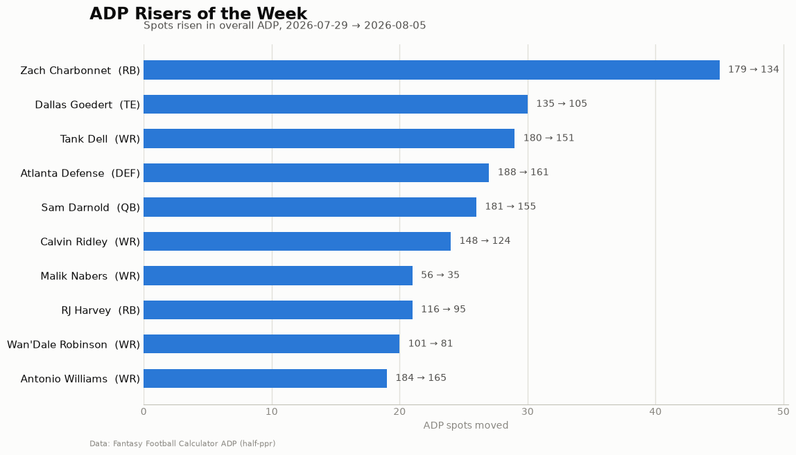

# ff-data-pipeline

Automated fantasy football ADP tracking and draft prep pipeline. Takes weekly ADP
snapshots from public sources, computes week-over-week movement (risers/fallers),
generates shareable movement charts, and syncs league data from the Sleeper API —
tuned for a 10-team half-PPR league ("Injury Prone" on Sleeper) with two FLEX
spots, where positional scarcity works differently than 12-team consensus ADP
assumes.

## Latest ADP Movement

<!-- ADP:START -->
Latest report: [reports/2026-08-05.md](reports/2026-08-05.md)


<!-- ADP:END -->

## Setup

```bash
python3 -m venv .venv && source .venv/bin/activate
pip install .
cp config.env.example .env   # then fill in SLEEPER_LEAGUE_ID (and optionally FANTASYPROS_API_KEY)
```

## Usage

```bash
python scripts/fetch_adp.py       # save today's ADP snapshot to data/adp/
python scripts/compute_deltas.py  # week-over-week movement (needs 2+ snapshots)
python scripts/generate_charts.py # ADP movement + positional distribution charts
python scripts/sleeper_sync.py    # pull league settings, rosters, player DB from Sleeper
python scripts/weekly_report.py   # full pipeline: fetch → deltas → charts → markdown report
```

Run `weekly_report.py` once a week (cron on Wednesdays recommended — ADP settles
midweek after camp news). Deltas and risers/fallers charts appear automatically
once two snapshots exist.

## Data layout

```
data/adp/       # weekly ADP snapshots (YYYY-MM-DD.csv, git-tracked for history)
data/league/    # Sleeper API pulls (rosters, settings, draft picks; player DB cached, untracked)
charts/         # generated PNGs (Twitter-sized 1200x675)
reports/        # weekly markdown reports
```

## Data sources

| Source | Access | Used for |
|---|---|---|
| [Fantasy Football Calculator](https://fantasyfootballcalculator.com/adp) | Free JSON API, no key | Primary ADP (real + mock drafts, league-size + scoring-format aware) |
| [FantasyPros](https://www.fantasypros.com/apis/) | Free API key (50 req/day) | Consensus ADP triangulation (optional) |
| [Sleeper API](https://docs.sleeper.com/) | Free, no auth | League settings, rosters, draft picks, player DB |

Delta convention: `delta = this_week_rank - last_week_rank` — negative is rising,
positive is falling.
