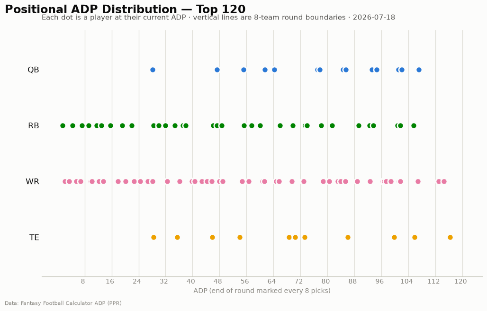

# ADP Report — 2026-07-18

*216 players tracked · sources: ffc · 8-team PPR*

## Movement

First snapshot recorded — week-over-week risers/fallers will appear in next week's report.

## Positional scarcity

In an **8-team league** replacement level runs much deeper than standard 10/12-team ADP assumes — consensus ADP overprices positional scarcity. Composition of the first 5 rounds (top 40 picks):

- **WR**: 19 drafted in the first 5 rounds
- **RB**: 18 drafted in the first 5 rounds
- **TE**: 2 drafted in the first 5 rounds
- **QB**: 1 drafted in the first 5 rounds

Onesie positions (QB/TE) are startable off the waiver wire in an 8-teamer — fade early-round QB/TE unless the tier cliff is real.

## Charts

