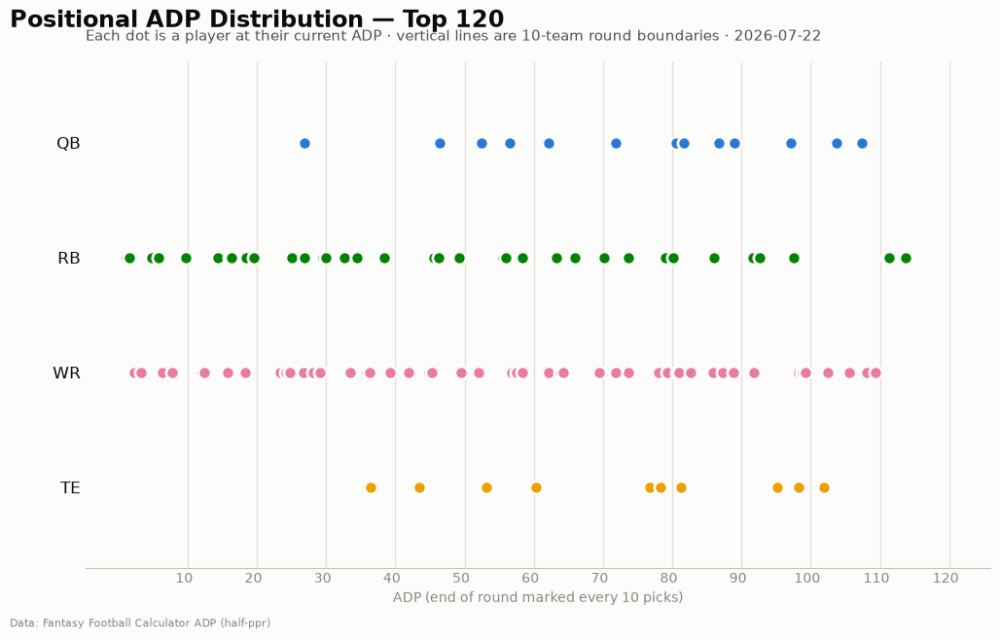
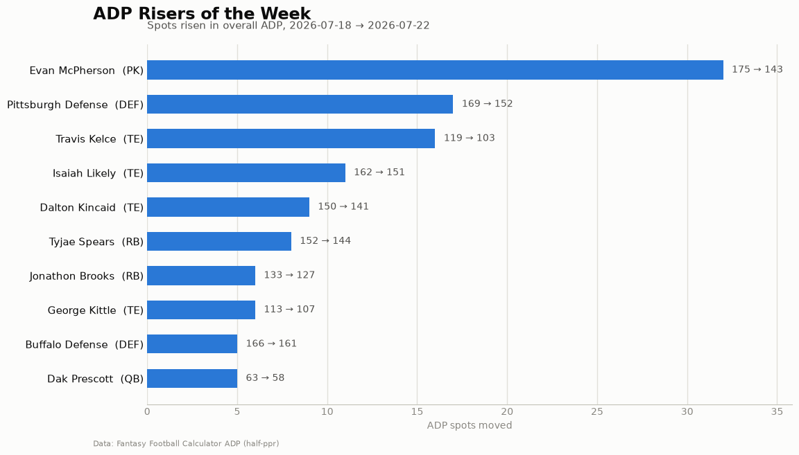
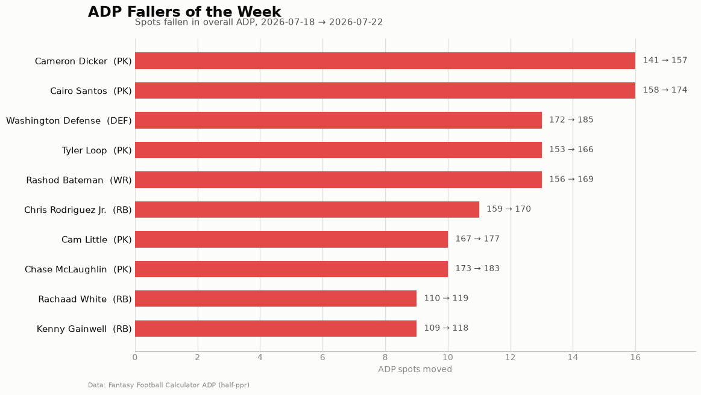

# ADP Report — 2026-07-22

*188 players tracked · sources: ffc · 10-team half-ppr*

## Top risers (2026-07-18 → 2026-07-22)

| Player | Pos | Last week | This week | Δ |
|---|---|---|---|---|
| Evan McPherson | PK | 175 | 143 | -32 |
| Pittsburgh Defense | DEF | 169 | 152 | -17 |
| Travis Kelce | TE | 119 | 103 | -16 |
| Isaiah Likely | TE | 162 | 151 | -11 |
| Dalton Kincaid | TE | 150 | 141 | -9 |
| Tyjae Spears | RB | 152 | 144 | -8 |
| Jonathon Brooks | RB | 133 | 127 | -6 |
| George Kittle | TE | 113 | 107 | -6 |
| Buffalo Defense | DEF | 166 | 161 | -5 |
| Dak Prescott | QB | 63 | 58 | -5 |

## Top fallers (2026-07-18 → 2026-07-22)

| Player | Pos | Last week | This week | Δ |
|---|---|---|---|---|
| Cameron Dicker | PK | 141 | 157 | +16 |
| Cairo Santos | PK | 158 | 174 | +16 |
| Washington Defense | DEF | 172 | 185 | +13 |
| Tyler Loop | PK | 153 | 166 | +13 |
| Rashod Bateman | WR | 156 | 169 | +13 |
| Chris Rodriguez Jr. | RB | 159 | 170 | +11 |
| Cam Little | PK | 167 | 177 | +10 |
| Chase McLaughlin | PK | 173 | 183 | +10 |
| Rachaad White | RB | 110 | 119 | +9 |
| Kenny Gainwell | RB | 109 | 118 | +9 |

## New to the player pool

Jaylen Warren (RB, ADP 64), Calvin Ridley (WR, ADP 145), Brenton Strange (TE, ADP 147), Eddy Piñeiro (PK, ADP 149), C.J. Stroud (QB, ADP 152), Isaac TeSlaa (WR, ADP 153), Alvin Kamara (RB, ADP 154), Keaton Mitchell (RB, ADP 158), Tyler Shough (QB, ADP 158), Brian Robinson Jr. (RB, ADP 160)

## Positional scarcity

Composition of the first 5 rounds (top 50 picks) in **10-team half-ppr** drafts:

- **WR**: 25 drafted in the first 5 rounds
- **RB**: 21 drafted in the first 5 rounds
- **QB**: 2 drafted in the first 5 rounds
- **TE**: 2 drafted in the first 5 rounds

With 10 teams, replacement level runs deeper than the 12-team consensus most rankings assume — onesie positions (QB/TE) are startable off the waiver wire, so fade early-round QB/TE unless the tier cliff is real. Two FLEX spots push RB/WR depth demand up.

## Charts

