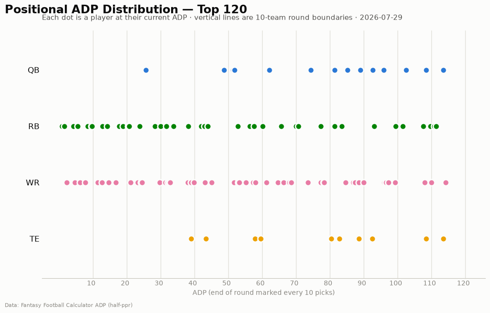
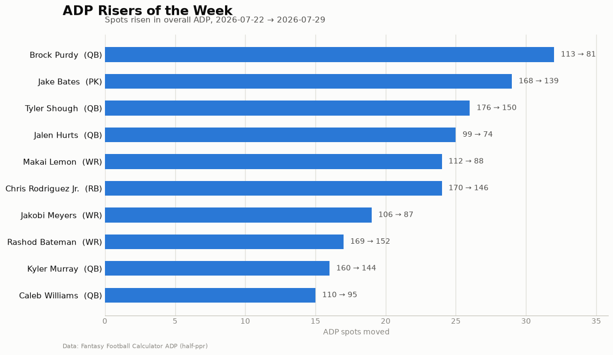
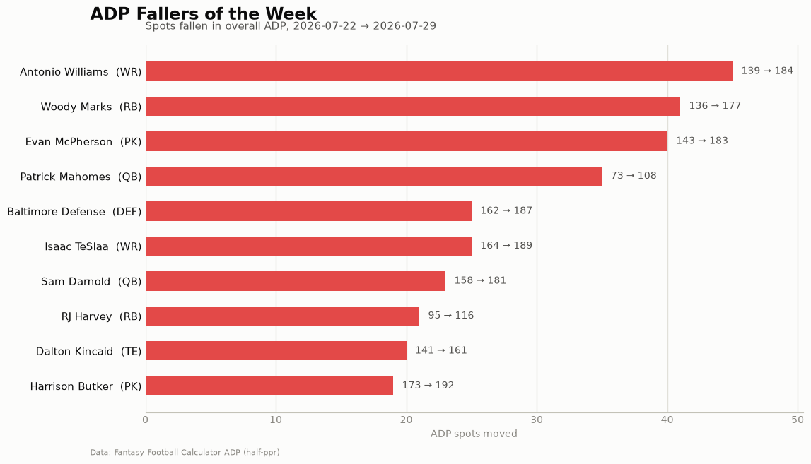

# ADP Report — 2026-07-29

*203 players tracked · sources: fantasypros, ffc · 10-team half-ppr*

## Top risers (2026-07-22 → 2026-07-29)

| Player | Pos | Last week | This week | Δ |
|---|---|---|---|---|
| Brock Purdy | QB | 113 | 81 | -32 |
| Jake Bates | PK | 168 | 139 | -29 |
| Tyler Shough | QB | 176 | 150 | -26 |
| Jalen Hurts | QB | 99 | 74 | -25 |
| Makai Lemon | WR | 112 | 88 | -24 |
| Chris Rodriguez Jr. | RB | 170 | 146 | -24 |
| Jakobi Meyers | WR | 106 | 87 | -19 |
| Rashod Bateman | WR | 169 | 152 | -17 |
| Kyler Murray | QB | 160 | 144 | -16 |
| Caleb Williams | QB | 110 | 95 | -15 |

## Top fallers (2026-07-22 → 2026-07-29)

| Player | Pos | Last week | This week | Δ |
|---|---|---|---|---|
| Antonio Williams | WR | 139 | 184 | +45 |
| Woody Marks | RB | 136 | 177 | +41 |
| Evan McPherson | PK | 143 | 183 | +40 |
| Patrick Mahomes | QB | 73 | 108 | +35 |
| Baltimore Defense | DEF | 162 | 187 | +25 |
| Isaac TeSlaa | WR | 164 | 189 | +25 |
| Sam Darnold | QB | 158 | 181 | +23 |
| RJ Harvey | RB | 95 | 116 | +21 |
| Dalton Kincaid | TE | 141 | 161 | +20 |
| Harrison Butker | PK | 173 | 192 | +19 |

## New to the player pool

Theo Wease Jr. (WR, ADP 128), Hunter Henry (TE, ADP 146), Ka'imi Fairbairn (PK, ADP 146), Harrison Mevis (PK, ADP 148), Adonai Mitchell (WR, ADP 148), Dallas Defense (DEF, ADP 153), Kayshon Boutte (WR, ADP 154), Kansas City Defense (DEF, ADP 160), Atlanta Defense (DEF, ADP 163), Malik Willis (QB, ADP 166)

## Positional scarcity

Composition of the first 5 rounds (top 50 picks) in **10-team half-ppr** drafts:

- **WR**: 23 drafted in the first 5 rounds
- **RB**: 22 drafted in the first 5 rounds
- **QB**: 3 drafted in the first 5 rounds
- **TE**: 2 drafted in the first 5 rounds

With 10 teams, replacement level runs deeper than the 12-team consensus most rankings assume — onesie positions (QB/TE) are startable off the waiver wire, so fade early-round QB/TE unless the tier cliff is real. Two FLEX spots push RB/WR depth demand up.

## Charts

