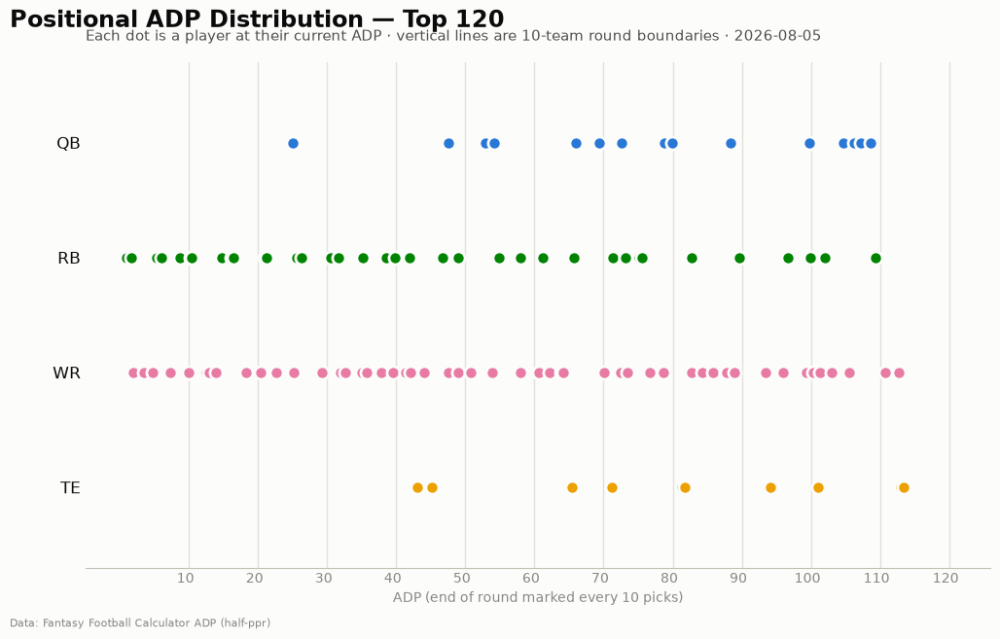
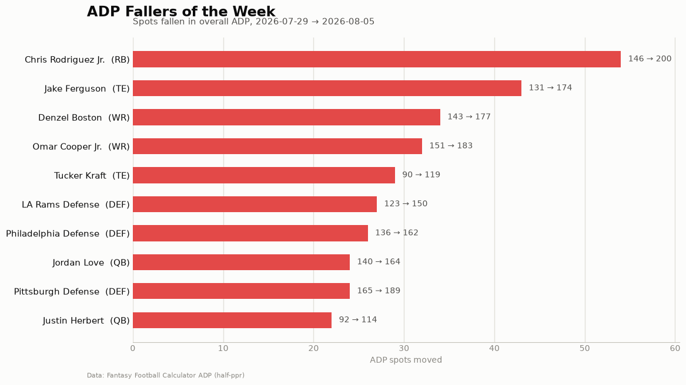

# ADP Report — 2026-08-05

*207 players tracked · sources: fantasypros, ffc · 10-team half-ppr*

## Top risers (2026-07-29 → 2026-08-05)

| Player | Pos | Last week | This week | Δ |
|---|---|---|---|---|
| Zach Charbonnet | RB | 179 | 134 | -45 |
| Dallas Goedert | TE | 135 | 105 | -30 |
| Tank Dell | WR | 180 | 151 | -29 |
| Atlanta Defense | DEF | 188 | 161 | -27 |
| Sam Darnold | QB | 181 | 155 | -26 |
| Calvin Ridley | WR | 148 | 124 | -24 |
| Malik Nabers | WR | 56 | 35 | -21 |
| RJ Harvey | RB | 116 | 95 | -21 |
| Wan'Dale Robinson | WR | 101 | 81 | -20 |
| Antonio Williams | WR | 184 | 165 | -19 |

## Top fallers (2026-07-29 → 2026-08-05)

| Player | Pos | Last week | This week | Δ |
|---|---|---|---|---|
| Chris Rodriguez Jr. | RB | 146 | 200 | +54 |
| Jake Ferguson | TE | 131 | 174 | +43 |
| Denzel Boston | WR | 143 | 177 | +34 |
| Omar Cooper Jr. | WR | 151 | 183 | +32 |
| Tucker Kraft | TE | 90 | 119 | +29 |
| LA Rams Defense | DEF | 123 | 150 | +27 |
| Philadelphia Defense | DEF | 136 | 162 | +26 |
| Jordan Love | QB | 140 | 164 | +24 |
| Pittsburgh Defense | DEF | 165 | 189 | +24 |
| Justin Herbert | QB | 92 | 114 | +22 |

## New to the player pool

Deebo Samuel Sr. (WR, ADP 94), John Metchie III (WR, ADP 118), Jake Tonges (TE, ADP 136), Tank Bigsby (RB, ADP 153), Kenyon Sadiq (TE, ADP 159), Tyler Bass (PK, ADP 161), Will Reichard (PK, ADP 162), De'Zhaun Stribling (WR, ADP 162), Juwan Johnson (TE, ADP 166), Jordan James (RB, ADP 167)

## Positional scarcity

Composition of the first 5 rounds (top 50 picks) in **10-team half-ppr** drafts:

- **WR**: 24 drafted in the first 5 rounds
- **RB**: 22 drafted in the first 5 rounds
- **QB**: 2 drafted in the first 5 rounds
- **TE**: 2 drafted in the first 5 rounds

With 10 teams, replacement level runs deeper than the 12-team consensus most rankings assume — onesie positions (QB/TE) are startable off the waiver wire, so fade early-round QB/TE unless the tier cliff is real. Two FLEX spots push RB/WR depth demand up.

## Charts

