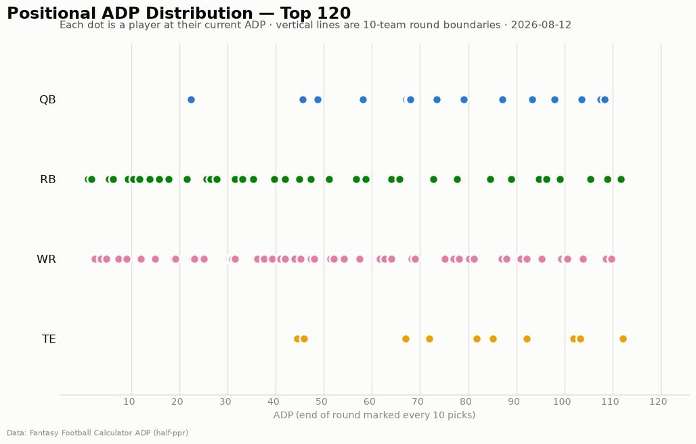
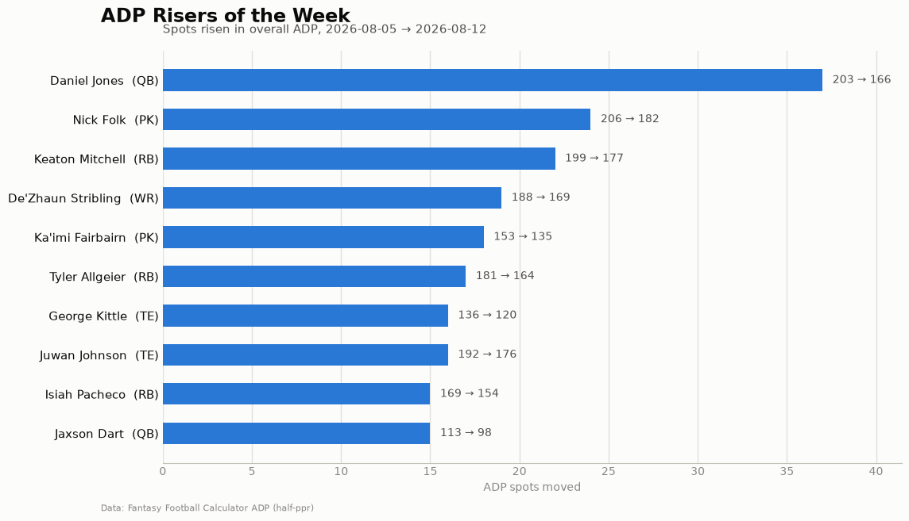
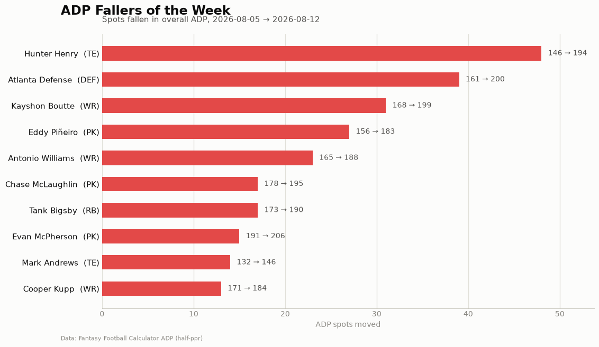

# ADP Report — 2026-08-12

*213 players tracked · sources: fantasypros, ffc · 10-team half-ppr*

## Top risers (2026-08-05 → 2026-08-12)

| Player | Pos | Last week | This week | Δ |
|---|---|---|---|---|
| Daniel Jones | QB | 203 | 166 | -37 |
| Nick Folk | PK | 206 | 182 | -24 |
| Keaton Mitchell | RB | 199 | 177 | -22 |
| De'Zhaun Stribling | WR | 188 | 169 | -19 |
| Ka'imi Fairbairn | PK | 153 | 135 | -18 |
| Tyler Allgeier | RB | 181 | 164 | -17 |
| George Kittle | TE | 136 | 120 | -16 |
| Juwan Johnson | TE | 192 | 176 | -16 |
| Isiah Pacheco | RB | 169 | 154 | -15 |
| Jaxson Dart | QB | 113 | 98 | -15 |

## Top fallers (2026-08-05 → 2026-08-12)

| Player | Pos | Last week | This week | Δ |
|---|---|---|---|---|
| Hunter Henry | TE | 146 | 194 | +48 |
| Atlanta Defense | DEF | 161 | 200 | +39 |
| Kayshon Boutte | WR | 168 | 199 | +31 |
| Eddy Piñeiro | PK | 156 | 183 | +27 |
| Antonio Williams | WR | 165 | 188 | +23 |
| Chase McLaughlin | PK | 178 | 195 | +17 |
| Tank Bigsby | RB | 173 | 190 | +17 |
| Evan McPherson | PK | 191 | 206 | +15 |
| Mark Andrews | TE | 132 | 146 | +14 |
| Cooper Kupp | WR | 171 | 184 | +13 |

## New to the player pool

Kenneth Walker (RB, ADP 27), Stefon Diggs (WR, ADP 91), James Conner (RB, ADP 148), Jonah Coleman (RB, ADP 149), Kimani Vidal (RB, ADP 150), Ja'Kobi Lane (WR, ADP 153), Malik Washington (WR, ADP 158), Jacksonville Defense (DEF, ADP 169), Andy Borregales (PK, ADP 172), C.J. Stroud (QB, ADP 173)

## Positional scarcity

Composition of the first 5 rounds (top 50 picks) in **10-team half-ppr** drafts:

- **WR**: 25 drafted in the first 5 rounds
- **RB**: 21 drafted in the first 5 rounds
- **QB**: 2 drafted in the first 5 rounds
- **TE**: 2 drafted in the first 5 rounds

With 10 teams, replacement level runs deeper than the 12-team consensus most rankings assume — onesie positions (QB/TE) are startable off the waiver wire, so fade early-round QB/TE unless the tier cliff is real. Two FLEX spots push RB/WR depth demand up.

## Charts

