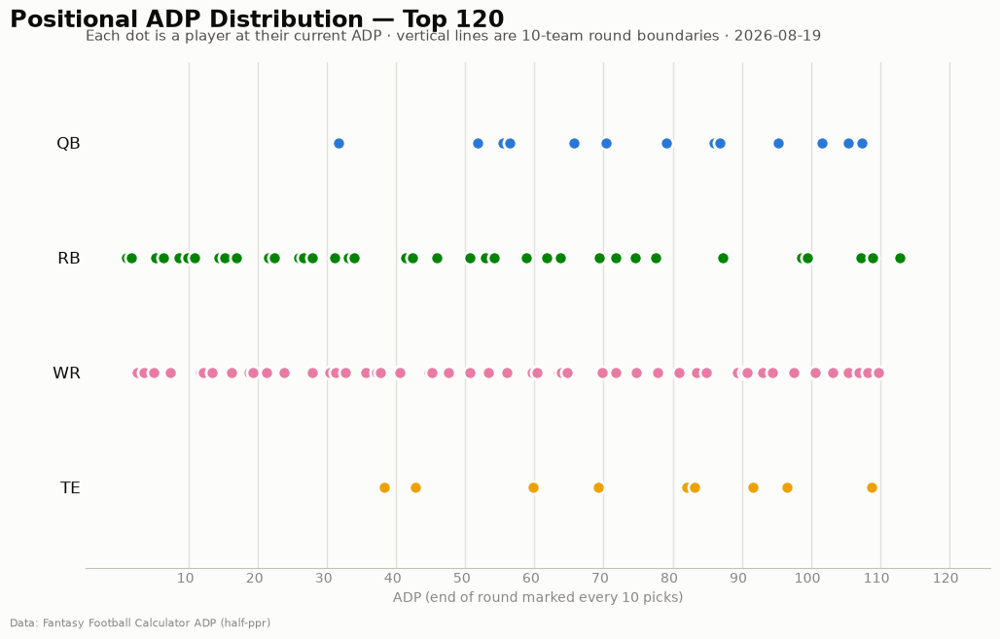
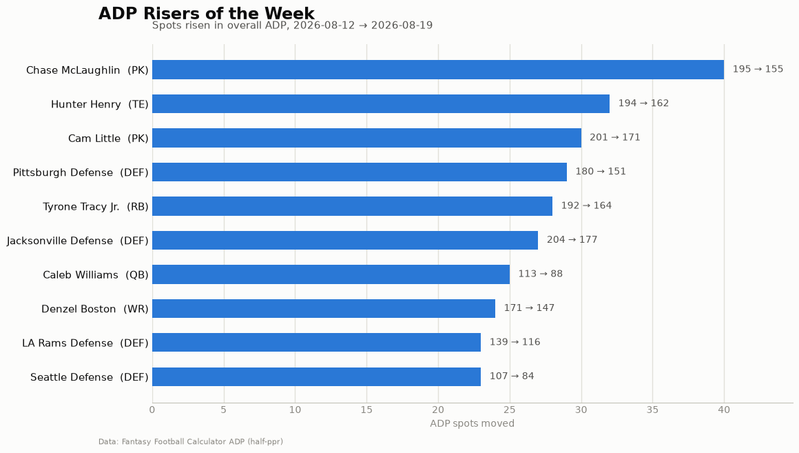
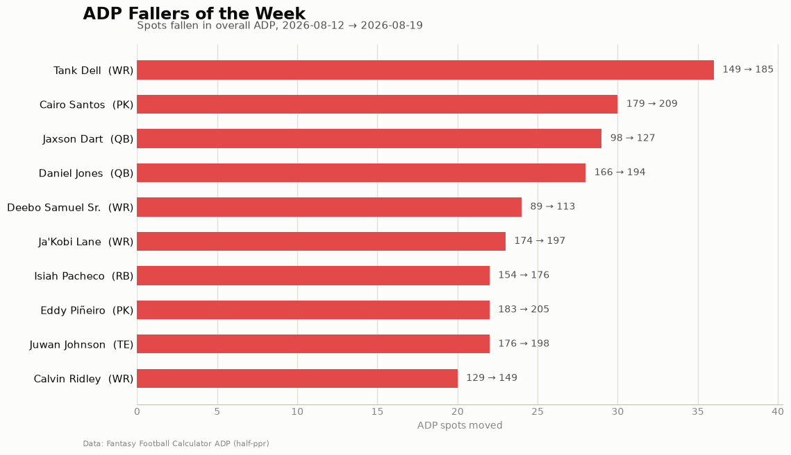

# ADP Report — 2026-08-19

*220 players tracked · sources: fantasypros, ffc · 10-team half-ppr*

## Top risers (2026-08-12 → 2026-08-19)

| Player | Pos | Last week | This week | Δ |
|---|---|---|---|---|
| Chase McLaughlin | PK | 195 | 155 | -40 |
| Hunter Henry | TE | 194 | 162 | -32 |
| Cam Little | PK | 201 | 171 | -30 |
| Pittsburgh Defense | DEF | 180 | 151 | -29 |
| Tyrone Tracy Jr. | RB | 192 | 164 | -28 |
| Jacksonville Defense | DEF | 204 | 177 | -27 |
| Caleb Williams | QB | 113 | 88 | -25 |
| Denzel Boston | WR | 171 | 147 | -24 |
| LA Rams Defense | DEF | 139 | 116 | -23 |
| Seattle Defense | DEF | 107 | 84 | -23 |

## Top fallers (2026-08-12 → 2026-08-19)

| Player | Pos | Last week | This week | Δ |
|---|---|---|---|---|
| Tank Dell | WR | 149 | 185 | +36 |
| Cairo Santos | PK | 179 | 209 | +30 |
| Jaxson Dart | QB | 98 | 127 | +29 |
| Daniel Jones | QB | 166 | 194 | +28 |
| Deebo Samuel Sr. | WR | 89 | 113 | +24 |
| Ja'Kobi Lane | WR | 174 | 197 | +23 |
| Isiah Pacheco | RB | 154 | 176 | +22 |
| Eddy Piñeiro | PK | 183 | 205 | +22 |
| Juwan Johnson | TE | 176 | 198 | +22 |
| Calvin Ridley | WR | 129 | 149 | +20 |

## New to the player pool

Tyler Bass (PK, ADP 145), Kaelon Black (RB, ADP 158), Ray Davis (RB, ADP 159), Dontayvion Wicks (WR, ADP 164), Braelon Allen (RB, ADP 164), Ryan Flournoy (WR, ADP 166), MarShawn Lloyd (RB, ADP 166), Brian Robinson (RB, ADP 169), Blake Grupe (PK, ADP 170), Jacoby Brissett (QB, ADP 173)

## Positional scarcity

Composition of the first 5 rounds (top 50 picks) in **10-team half-ppr** drafts:

- **WR**: 26 drafted in the first 5 rounds
- **RB**: 21 drafted in the first 5 rounds
- **TE**: 2 drafted in the first 5 rounds
- **QB**: 1 drafted in the first 5 rounds

With 10 teams, replacement level runs deeper than the 12-team consensus most rankings assume — onesie positions (QB/TE) are startable off the waiver wire, so fade early-round QB/TE unless the tier cliff is real. Two FLEX spots push RB/WR depth demand up.

## Charts

