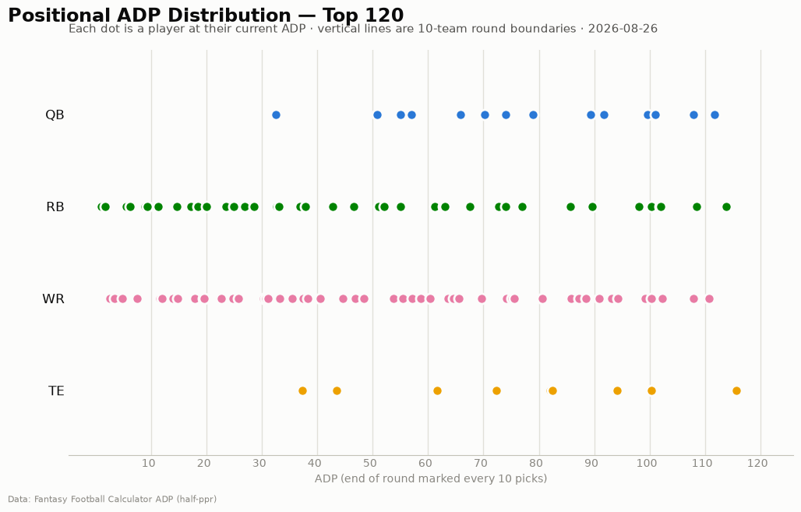
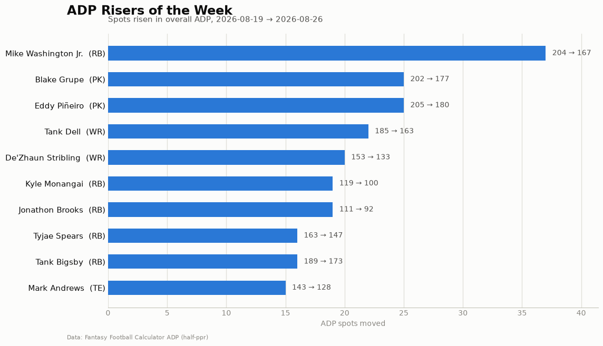
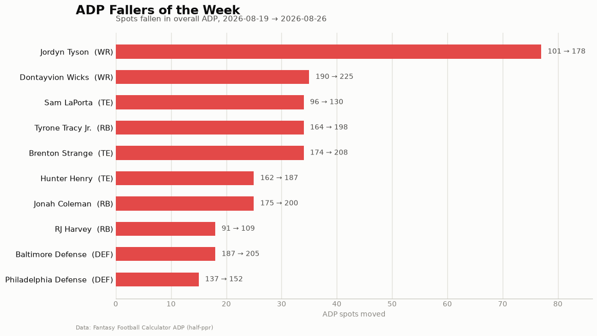

# ADP Report — 2026-08-26

*228 players tracked · sources: fantasypros, ffc · 10-team half-ppr*

## Top risers (2026-08-19 → 2026-08-26)

| Player | Pos | Last week | This week | Δ |
|---|---|---|---|---|
| Mike Washington Jr. | RB | 204 | 167 | -37 |
| Blake Grupe | PK | 202 | 177 | -25 |
| Eddy Piñeiro | PK | 205 | 180 | -25 |
| Tank Dell | WR | 185 | 163 | -22 |
| De'Zhaun Stribling | WR | 153 | 133 | -20 |
| Kyle Monangai | RB | 119 | 100 | -19 |
| Jonathon Brooks | RB | 111 | 92 | -19 |
| Tyjae Spears | RB | 163 | 147 | -16 |
| Tank Bigsby | RB | 189 | 173 | -16 |
| Mark Andrews | TE | 143 | 128 | -15 |

## Top fallers (2026-08-19 → 2026-08-26)

| Player | Pos | Last week | This week | Δ |
|---|---|---|---|---|
| Jordyn Tyson | WR | 101 | 178 | +77 |
| Dontayvion Wicks | WR | 190 | 225 | +35 |
| Sam LaPorta | TE | 96 | 130 | +34 |
| Tyrone Tracy Jr. | RB | 164 | 198 | +34 |
| Brenton Strange | TE | 174 | 208 | +34 |
| Hunter Henry | TE | 162 | 187 | +25 |
| Jonah Coleman | RB | 175 | 200 | +25 |
| RJ Harvey | RB | 91 | 109 | +18 |
| Baltimore Defense | DEF | 187 | 205 | +18 |
| Philadelphia Defense | DEF | 137 | 152 | +15 |

## New to the player pool

Keenan Allen (WR, ADP 136), Emmett Johnson (RB, ADP 146), Cyrus Allen (WR, ADP 150), Darius Slayton (WR, ADP 163), Devaughn Vele (WR, ADP 165), Pat Bryant (WR, ADP 169), Dallas Defense (DEF, ADP 171), Chris Boswell (PK, ADP 171), Cam Ward (QB, ADP 172), Trey Smack (PK, ADP 174)

## Positional scarcity

Composition of the first 5 rounds (top 50 picks) in **10-team half-ppr** drafts:

- **WR**: 26 drafted in the first 5 rounds
- **RB**: 21 drafted in the first 5 rounds
- **TE**: 2 drafted in the first 5 rounds
- **QB**: 1 drafted in the first 5 rounds

With 10 teams, replacement level runs deeper than the 12-team consensus most rankings assume — onesie positions (QB/TE) are startable off the waiver wire, so fade early-round QB/TE unless the tier cliff is real. Two FLEX spots push RB/WR depth demand up.

## Charts

