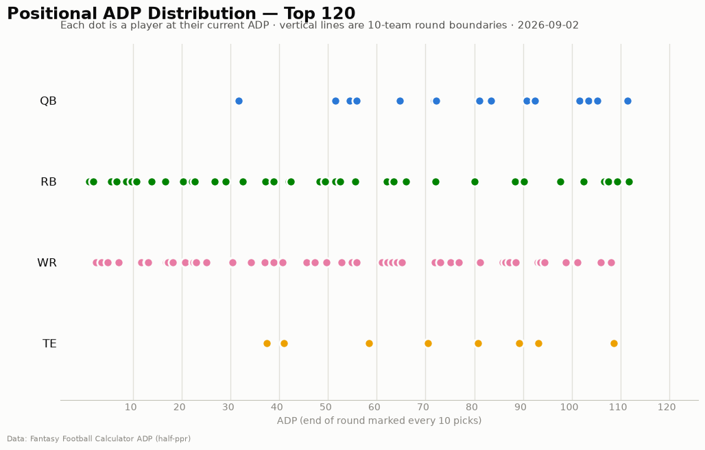
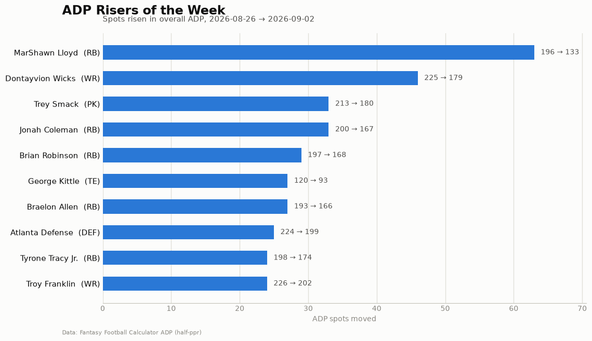
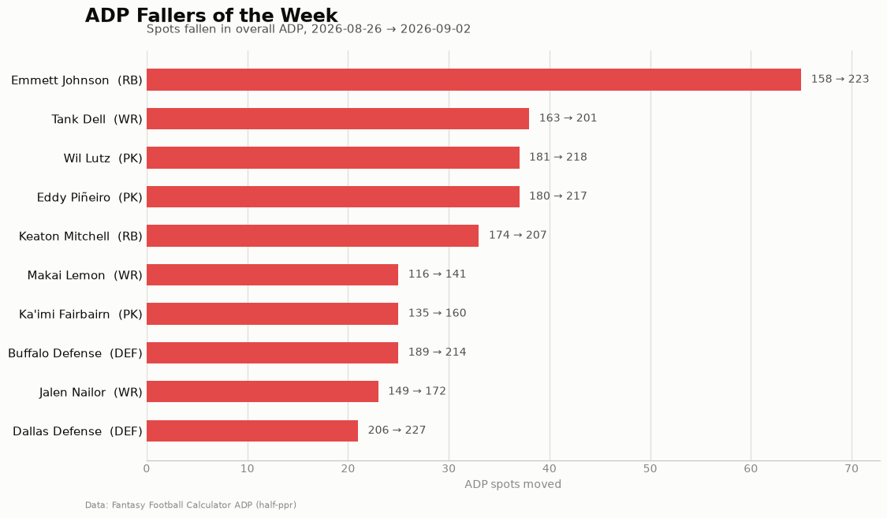

# ADP Report — 2026-09-02

*233 players tracked · sources: fantasypros, ffc · 10-team half-ppr*

## Top risers (2026-08-26 → 2026-09-02)

| Player | Pos | Last week | This week | Δ |
|---|---|---|---|---|
| MarShawn Lloyd | RB | 196 | 133 | -63 |
| Dontayvion Wicks | WR | 225 | 179 | -46 |
| Trey Smack | PK | 213 | 180 | -33 |
| Jonah Coleman | RB | 200 | 167 | -33 |
| Brian Robinson | RB | 197 | 168 | -29 |
| George Kittle | TE | 120 | 93 | -27 |
| Braelon Allen | RB | 193 | 166 | -27 |
| Atlanta Defense | DEF | 224 | 199 | -25 |
| Tyrone Tracy Jr. | RB | 198 | 174 | -24 |
| Troy Franklin | WR | 226 | 202 | -24 |

## Top fallers (2026-08-26 → 2026-09-02)

| Player | Pos | Last week | This week | Δ |
|---|---|---|---|---|
| Emmett Johnson | RB | 158 | 223 | +65 |
| Tank Dell | WR | 163 | 201 | +38 |
| Wil Lutz | PK | 181 | 218 | +37 |
| Eddy Piñeiro | PK | 180 | 217 | +37 |
| Keaton Mitchell | RB | 174 | 207 | +33 |
| Makai Lemon | WR | 116 | 141 | +25 |
| Ka'imi Fairbairn | PK | 135 | 160 | +25 |
| Buffalo Defense | DEF | 189 | 214 | +25 |
| Jalen Nailor | WR | 149 | 172 | +23 |
| Dallas Defense | DEF | 206 | 227 | +21 |

## New to the player pool

Ollie Gordon II (RB, ADP 52), Malachi Fields (WR, ADP 156), Oronde Gadsden (TE, ADP 157), Ray Davis (RB, ADP 160), Tyler Bass (PK, ADP 161), Jaylin Noel (WR, ADP 165), NY Giants Defense (DEF, ADP 168), Bryce Young (QB, ADP 170), Jacoby Brissett (QB, ADP 170), Isaac TeSlaa (WR, ADP 171)

## Positional scarcity

Composition of the first 5 rounds (top 50 picks) in **10-team half-ppr** drafts:

- **WR**: 25 drafted in the first 5 rounds
- **RB**: 22 drafted in the first 5 rounds
- **TE**: 2 drafted in the first 5 rounds
- **QB**: 1 drafted in the first 5 rounds

With 10 teams, replacement level runs deeper than the 12-team consensus most rankings assume — onesie positions (QB/TE) are startable off the waiver wire, so fade early-round QB/TE unless the tier cliff is real. Two FLEX spots push RB/WR depth demand up.

## Charts

