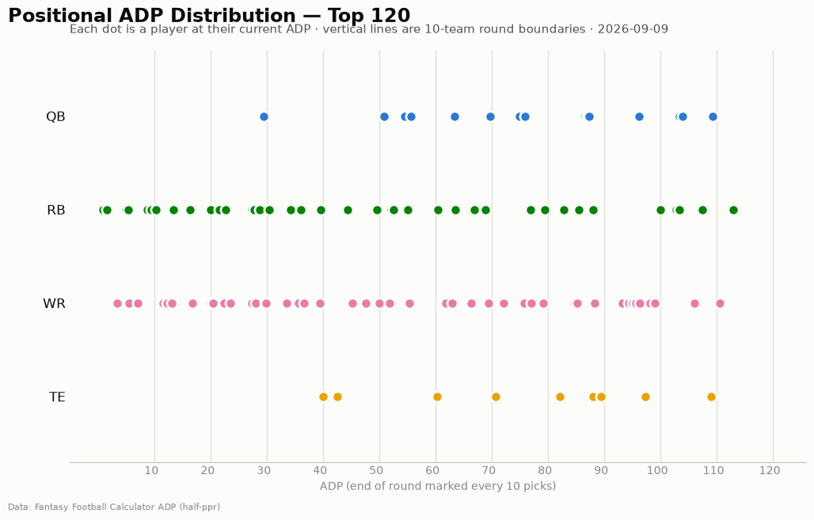
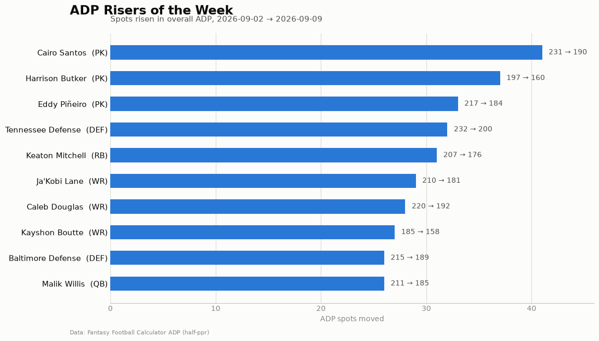
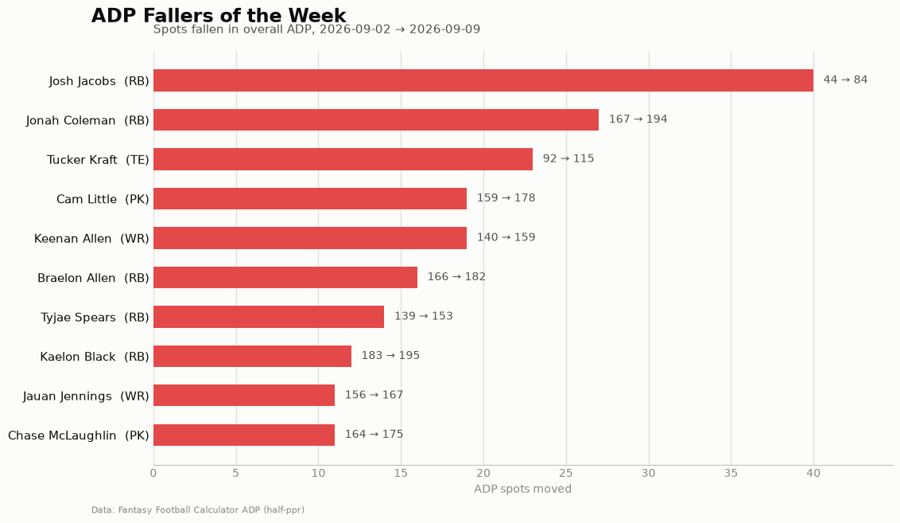

# ADP Report — 2026-09-09

*203 players tracked · sources: fantasypros, ffc · 10-team half-ppr*

## Top risers (2026-09-02 → 2026-09-09)

| Player | Pos | Last week | This week | Δ |
|---|---|---|---|---|
| Cairo Santos | PK | 231 | 190 | -41 |
| Harrison Butker | PK | 197 | 160 | -37 |
| Eddy Piñeiro | PK | 217 | 184 | -33 |
| Tennessee Defense | DEF | 232 | 200 | -32 |
| Keaton Mitchell | RB | 207 | 176 | -31 |
| Ja'Kobi Lane | WR | 210 | 181 | -29 |
| Caleb Douglas | WR | 220 | 192 | -28 |
| Kayshon Boutte | WR | 185 | 158 | -27 |
| Baltimore Defense | DEF | 215 | 189 | -26 |
| Malik Willis | QB | 211 | 185 | -26 |

## Top fallers (2026-09-02 → 2026-09-09)

| Player | Pos | Last week | This week | Δ |
|---|---|---|---|---|
| Josh Jacobs | RB | 44 | 84 | +40 |
| Jonah Coleman | RB | 167 | 194 | +27 |
| Tucker Kraft | TE | 92 | 115 | +23 |
| Cam Little | PK | 159 | 178 | +19 |
| Keenan Allen | WR | 140 | 159 | +19 |
| Braelon Allen | RB | 166 | 182 | +16 |
| Tyjae Spears | RB | 139 | 153 | +14 |
| Kaelon Black | RB | 183 | 195 | +12 |
| Jauan Jennings | WR | 156 | 167 | +11 |
| Chase McLaughlin | PK | 164 | 175 | +11 |

## Positional scarcity

Composition of the first 5 rounds (top 50 picks) in **10-team half-ppr** drafts:

- **WR**: 26 drafted in the first 5 rounds
- **RB**: 21 drafted in the first 5 rounds
- **TE**: 2 drafted in the first 5 rounds
- **QB**: 1 drafted in the first 5 rounds

With 10 teams, replacement level runs deeper than the 12-team consensus most rankings assume — onesie positions (QB/TE) are startable off the waiver wire, so fade early-round QB/TE unless the tier cliff is real. Two FLEX spots push RB/WR depth demand up.

## Charts

