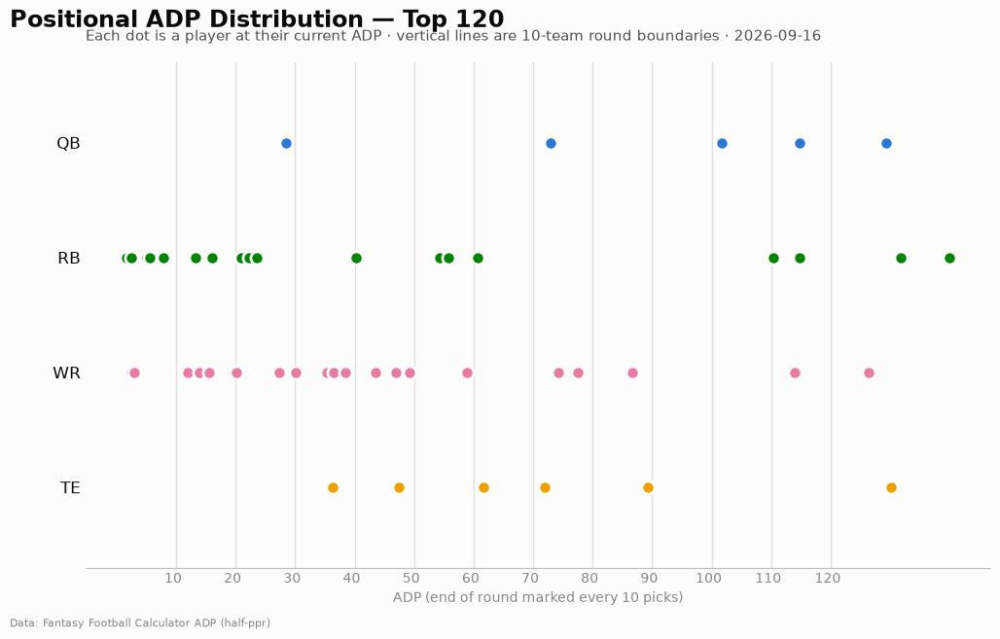
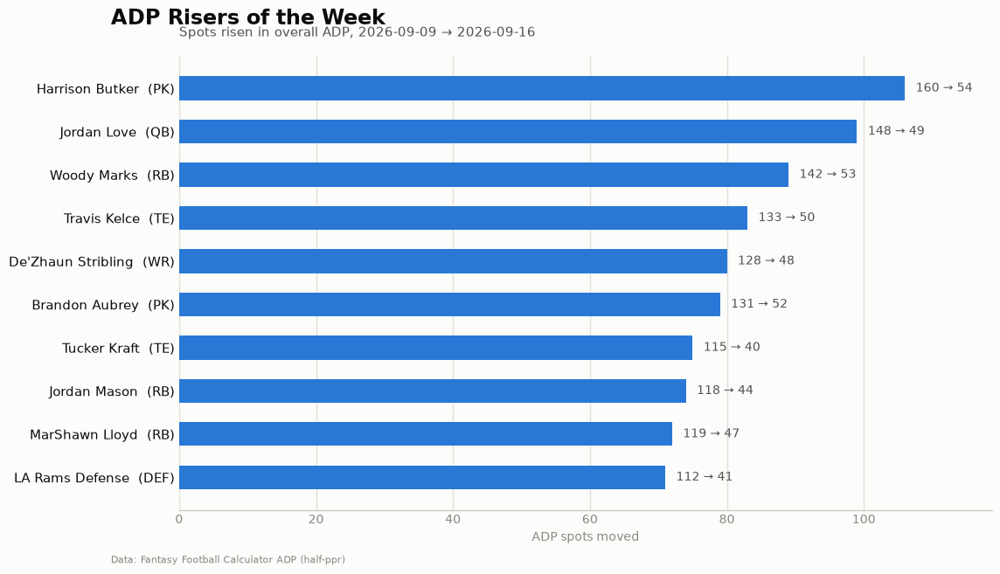

# ADP Report — 2026-09-16

*54 players tracked · sources: fantasypros, ffc · 10-team half-ppr*

## Top risers (2026-09-09 → 2026-09-16)

| Player | Pos | Last week | This week | Δ |
|---|---|---|---|---|
| Harrison Butker | PK | 160 | 54 | -106 |
| Jordan Love | QB | 148 | 49 | -99 |
| Woody Marks | RB | 142 | 53 | -89 |
| Travis Kelce | TE | 133 | 50 | -83 |
| De'Zhaun Stribling | WR | 128 | 48 | -80 |
| Brandon Aubrey | PK | 131 | 52 | -79 |
| Tucker Kraft | TE | 115 | 40 | -75 |
| Jordan Mason | RB | 118 | 44 | -74 |
| MarShawn Lloyd | RB | 119 | 47 | -72 |
| LA Rams Defense | DEF | 112 | 41 | -71 |

## Top fallers (2026-09-09 → 2026-09-16)

| Player | Pos | Last week | This week | Δ |
|---|---|---|---|---|

## New to the player pool

KC Concepcion Jr. (WR, ADP 114)

## Positional scarcity

Composition of the first 5 rounds (top 50 picks) in **10-team half-ppr** drafts:

- **WR**: 20 drafted in the first 5 rounds
- **RB**: 17 drafted in the first 5 rounds
- **TE**: 6 drafted in the first 5 rounds
- **QB**: 5 drafted in the first 5 rounds
- **DEF**: 2 drafted in the first 5 rounds

With 10 teams, replacement level runs deeper than the 12-team consensus most rankings assume — onesie positions (QB/TE) are startable off the waiver wire, so fade early-round QB/TE unless the tier cliff is real. Two FLEX spots push RB/WR depth demand up.

## Charts

