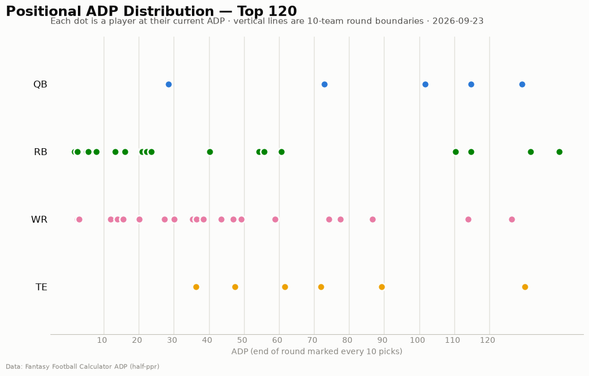

# ADP Report — 2026-09-23

*54 players tracked · sources: fantasypros, ffc · 10-team half-ppr*

## Top risers (2026-09-16 → 2026-09-23)

| Player | Pos | Last week | This week | Δ |
|---|---|---|---|---|

## Top fallers (2026-09-16 → 2026-09-23)

| Player | Pos | Last week | This week | Δ |
|---|---|---|---|---|

## Positional scarcity

Composition of the first 5 rounds (top 50 picks) in **10-team half-ppr** drafts:

- **WR**: 20 drafted in the first 5 rounds
- **RB**: 17 drafted in the first 5 rounds
- **TE**: 6 drafted in the first 5 rounds
- **QB**: 5 drafted in the first 5 rounds
- **DEF**: 2 drafted in the first 5 rounds

With 10 teams, replacement level runs deeper than the 12-team consensus most rankings assume — onesie positions (QB/TE) are startable off the waiver wire, so fade early-round QB/TE unless the tier cliff is real. Two FLEX spots push RB/WR depth demand up.

## Charts

